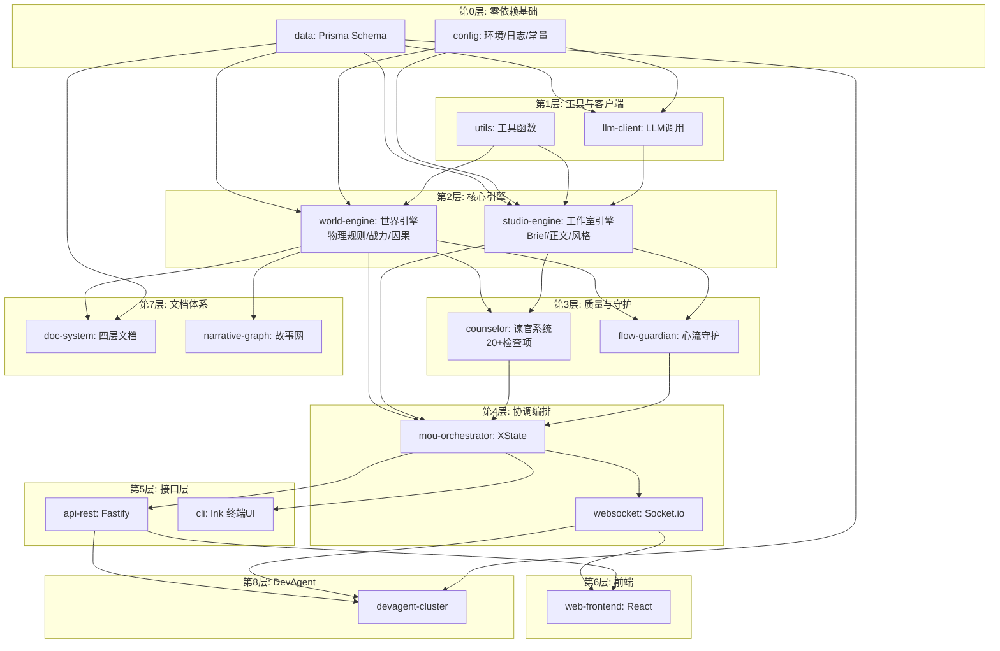

> [!NOTE] **本文档的前端 Phase 描述已作废 · 后端 Phase 排期仍可参考**
> 文中"P6 前端驾驶舱 / React 驾驶舱界面 / pages: 驾驶舱·世界管理·章节编辑·谏官报告"等描述对应旧赛博风前端，已于 2026-05-19 整目录删除并重写为"司天监位面"。
> Phase 排期权威源：`docs/iterations/index.md`（已扩展到 P0–P11 + G1–G5 + P0'–P11'）；前端真理源：`docs/imperial-design-system.md`。
> **后端 Phase 目标、模块依赖、里程碑节点仍有参考价值**。

---

# NarrativeOS v3.0 Sovereign —— 完整开发路线图

> **版本**: v1.0-DevelopmentRoadmap  
> **适用范围**: 单人业余开发者 + Claude Code (kimi2.6)  
> **时间模型**: 工作日 3h/天 + 周末 8h/天 = 约 31h/周  
> **总工期估算**: 18-22 周（约 4.5-5.5 个月）  
> **设计文档基础**: 87,122 行，9 卷 25 章  

---

## 目录

- [1. 总体开发策略](#1-总体开发策略)
- [2. 模块依赖图](#2-模块依赖图)
- [3. 十二阶段开发路线图总览](#3-十二阶段开发路线图总览)
- [4. Phase 0-5 详细任务清单](#4-phase-0-5-详细任务清单)
- [5. Phase 6-11 详细任务清单](#5-phase-6-11-详细任务清单)
- [6. 每日开发节奏建议](#6-每日开发节奏建议)
- [7. 风险缓解策略](#7-风险缓解策略)
- [附录 A: 项目目录结构规范](#附录-a-项目目录结构规范)
- [附录 B: 验收检查清单模板](#附录-b-验收检查清单模板)
- [附录 C: Claude Code Prompt 模板速查表](#附录-c-claude-code-prompt-模板速查表)

---

## 1. 总体开发策略

### 1.1 模块化并行策略

NarrativeOS v3.0 是一个大型系统（设计文档 87,122 行，预估代码量 15-20 万行），但**模块间存在明确的依赖边界**。对于单人开发，"并行"不是指同时写多个模块，而是指**每个模块可以被独立设计、独立测试、独立验证**，不需要等上游全部完成才能开始。

**可独立开发的模块（零外部依赖）**:

| 模块 | 独立原因 | 开发顺序建议 |
|------|----------|-------------|
| **数据库 Schema** | 零依赖，所有其他模块都依赖它 | **第 1 个做** |
| **配置/工具层** | 纯工具函数，零业务依赖 | 与 Schema 并行 |
| **LLM 客户端** | 仅依赖配置，可用 Mock 服务器 | 与 Schema 并行 |
| **类型定义/DTO** | 仅依赖数据库 Schema | Schema 完成后 |
| **前端组件库** | 可用 Storybook 独立开发 | Phase 6 开始 |

**Mock 驱动的并行开发链**:

```
Phase 1: 数据库 Schema ──────────────────────────────────────▶
              │                                               │
              ▼                                               ▼
Phase 2: 配置层 + LLM客户端(带Mock) ──────────────────────────▶
              │                                               │
              ▼                                               ▼
Phase 3: 世界引擎(硬编码规则) ──────▶ 可独立测试的完整引擎    │
              │                                               │
              ▼                                               ▼
Phase 4: 工作室引擎(接入LLM) ───────▶ 第一个端到端切片        │
              │                                               │
              ▼                                               ▼
Phase 5: 协调层+XState ────────────▶ MOU 完整闭环            │
              │                                               │
              ▼                                               ▼
Phase 6: 前端驾驶舱 ───────────────▶ 用户可交互的完整系统    │
```

### 1.2 数据库先行原则

**为什么数据库 Schema 是一切的基础？**

NarrativeOS 是一个**状态密集**的系统：世界状态、人物状态、章节状态、MOU 状态机上下文、谏官报告、历史版本——几乎所有操作都是围绕数据状态的读写转换。设计文档中定义了 50+ 张表、30+ 枚举类型、10+ 向量索引。先把 Schema 定下来，有三大好处：

1. **TypeScript 类型自动推导**: Prisma Client 自动生成类型定义，上层代码零类型维护成本
2. **接口契约前置**: 引擎间的数据交换格式由 Schema 定义，减少沟通成本（自己和 AI 的沟通成本）
3. **测试数据可复用**: Seed 数据一次编写，全生命周期复用（单元测试、集成测试、演示）

**数据库先行的执行策略**:

```
Week 1 目标: 完成 Prisma Schema 中所有表的定义

Day 1-2: 核心表（projects, novels, chapters, entities, relations）
Day 3-4: 世界引擎表（realm_systems, power_systems, events, ripples, foreshadowings）
Day 5-6: 工作室引擎表（briefs, content_revisions, ama_profiles, genre_kernels）
Day 7:   MOU/协调层表（mou_sessions, proposals, remonstrator_reports, flow_states）

→ 每个表定义后立即写对应的 seed 数据（3-5 条）
→ 每个表定义后立即写一个 CRUD 单元测试
```

### 1.3 假服务 (Mock) 策略

**核心原则: 没有 LLM API，前端和后端也能跑。**

这是单人开发最重要的策略。LLM API 调用有三大不确定性：成本、延迟、可用性。用 Mock 服务把这些不确定性隔离掉，可以确保开发不被阻塞。

**三层 Mock 架构**:

```
┌─────────────────────────────────────────────────────────┐
│                    LLM 调用接口 (统一)                      │
│              interface LLMClient {                        │
│                call(request: LLMRequest): Promise<LLMResponse>  │
│              }                                            │
└────────────────────┬────────────────────────────────────┘
                     │
        ┌────────────┼────────────┐
        ▼            ▼            ▼
   ┌─────────┐ ┌──────────┐ ┌──────────┐
   │ RealLLM │ │ MockLLM  │ │ CachedLLM│
   │ 真实API │ │ 假响应   │ │ 缓存层   │
   └─────────┘ └──────────┘ └──────────┘
```

**MockLLM 实现要点**:

| 调用点 | Mock 响应内容 | 用途 |
|--------|-------------|------|
| 可能性清单 | 预置 3-5 条 JSON 格式的假可能性 | 测试 MOU 循环 |
| Brief 生成 | 预置 Brief JSON（约 500 字段填充） | 测试 Brief 审批流 |
| 正文生成 | 返回一段固定文本（如《凡人修仙传》节选） | 测试内容展示 |
| 质量评分 | 返回固定分数 (0.7-0.9) + 假评语 | 测试谏官报告展示 |
| 战力检查 | 返回 "无异常" | 测试规则引擎通路 |

**Mock 切换配置**:

```typescript
// config/mock.config.ts
export const mockConfig = {
  // 全局 Mock 开关
  globalMock: process.env.USE_MOCK === 'true',
  
  // 按调用点精细控制
  mockPoints: {
    'world.possibilities': true,    // Mock 可能性清单
    'world.npc_intent': true,       // Mock NPC 意图
    'studio.brief': true,           // Mock Brief 生成
    'studio.content': true,         // Mock 正文生成
    'studio.quality_score': true,   // Mock 质量评分
    'counselor.power_check': false, // 规则引擎用真实计算
  },
  
  // Mock 响应延迟（模拟真实网络延迟）
  artificialDelay: 500, // ms
};
```

### 1.4 垂直切片策略

**水平分层 vs 垂直切片**:

```
❌ 错误：水平分层 —— "这周写完后端所有层，下周写前端"
   Phase 1: 数据库 ──→ Phase 2: 服务层 ──→ Phase 3: API层 ──→ Phase 4: 前端
   问题：前3周看不到任何东西在运行，容易失去信心

✅ 正确：垂直切片 —— "每个 Phase 交付一个完整可用的功能"
   Phase 3: 世界引擎MVP = 数据库存储 + 规则计算 + CLI调用 + 测试验证 ✓
   Phase 4: 工作室MVP = 数据库 + LLM调用 + Brief生成 + 审批流程 ✓
   Phase 5: MOU协调层 = XState + WebSocket + 完整闭环 ✓
   Phase 6: 前端MVP = React + WebSocket + 驾驶舱界面 ✓
```

**每个垂直切片的验收标准**:
1. 有一个可以运行的命令/页面
2. 有可以看到的输出（不是单元测试通过就算）
3. 有一个 "Hello World" 级别的用户交互

---

## 2. 模块依赖图

### 2.1 完整依赖拓扑（文字描述）

```
═══════════════════════════════════════════════════════════════
                        依赖层级图（从底向上）
═══════════════════════════════════════════════════════════════

第 0 层 ———— 零依赖基础（最先构建）
├── data: Prisma Schema + 迁移 + Seed + 基础 CRUD
└── config: 环境变量 + 日志 + 错误定义 + 常量

第 1 层 ———— 工具与客户端（仅依赖第 0 层）
├── llm-client: LLM 调用封装 + Mock 实现 + Token 计数
└── utils: 字符串处理 + 日期 + ID 生成 + 验证

第 2 层 ———— 核心引擎（依赖第 0 + 1 层）
├── world-engine: 物理规则 + 战力计算 + 因果推演（硬编码）
│   ├── sub: 地理引擎 (GeoEng)
│   ├── sub: 势力引擎 (FrcEng)
│   ├── sub: 人物引擎 (ChrEng)
│   ├── sub: 事件引擎 (EvtEng)
│   ├── sub: 规则引擎 (RulEng)
│   ├── sub: 伏笔引擎 (FtnEng)
│   ├── sub: 时间引擎 (TmlEng)
│   └── sub: 知识引擎 (KnoEng)
└── studio-engine: Brief 生成 + 正文生成 + 修改系统
    ├── sub: 类型内核 (GenreKernel)
    ├── sub: AMA 风格蒸馏 (AMAStyle)
    ├── sub: 上下文组装 (ContextBuilder)
    └── sub: 读者知识图谱 (ReaderKG)

第 3 层 ———— 质量与守护（依赖第 2 层接口）
├── counselor: 谏官系统（20+ 检查项）
│   ├── sub: 战力检查 (C01)
│   ├── sub: 人设检查 (C02)
│   ├── sub: 伏笔追踪 (C03)
│   └── sub: ...（共 20 项）
└── flow-guardian: 心流监测 + 超时召回 + 状态分析

第 4 层 ———— 协调与编排（依赖第 2 + 3 层）
├── mou-orchestrator: XState v5 状态机
│   ├── mou.statemachine.ts (父状态机)
│   ├── oracle.statemachine.ts (Oracle 子状态机)
│   └── event.router.ts (事件路由器)
└── websocket: Socket.io 服务器 + 房间管理

第 5 层 ———— 接口层（依赖第 4 层）
├── api-rest: Fastify REST API
├── api-ws: WebSocket 消息协议实现
└── cli: Ink 终端 UI

第 6 层 ———— 前端（依赖第 5 层 WebSocket API）
└── web-frontend: React 19 + Tailwind + Zustand
    ├── pages: 驾驶舱 / 世界管理 / 章节编辑 / 谏官报告
    ├── components: 共享组件库
    └── hooks: WebSocket + API 调用

第 7 层 ———— 文档体系（依赖第 0 + 2 层）
├── doc-system: 四层文档（设定集 / 大纲 / 卷纲 / 章纲）
├── narrative-graph: 故事线 + 关系网可视化
└── revision-manager: Retcon 修订管理

第 8 层 ———— DevAgent（依赖所有以上 + 外部 Git）
└── devagent-cluster:
    ├── telemetry: 遥测探针
    ├── router: 分类路由
    ├── swarm: 智能体群
    ├── validation: 验证部署
    └── knowledge: 知识库

═══════════════════════════════════════════════════════════════
```

### 2.2 Mermaid 依赖图



### 2.3 依赖矩阵速查表

| 模块 | 第 0 层 | 第 1 层 | 第 2 层 | 第 3 层 | 第 4 层 | 第 5 层 | 可 Mock 的依赖 |
|------|--------|--------|--------|--------|--------|--------|--------------|
| config | — | — | — | — | — | — | 无 |
| data | — | — | — | — | — | — | 无 |
| llm-client | 依赖 | — | — | — | — | — | 无（但可以全 Mock） |
| world-engine | 依赖 | 依赖 | — | — | — | — | LLM 调用 |
| studio-engine | 依赖 | 依赖 | — | — | — | — | LLM 调用 |
| counselor | 依赖 | 依赖 | 接口 | — | — | — | world/studio 结果 |
| flow-guardian | 依赖 | 依赖 | 接口 | — | — | — | world/studio 结果 |
| mou-orchestrator | 依赖 | 依赖 | 接口 | 接口 | — | — | 引擎执行结果 |
| websocket | 依赖 | — | — | — | 依赖 | — | 无 |
| api-rest | 依赖 | — | — | — | 依赖 | — | 无 |
| web-frontend | — | — | — | — | — | 依赖 | WebSocket 消息 |
| doc-system | 依赖 | — | 接口 | — | — | — | 引擎接口 |
| devagent-cluster | 依赖 | 依赖 | 接口 | 接口 | 接口 | 接口 | Git 操作 |

---

## 3. 十二阶段开发路线图总览

### 3.1 时间线总览

```
周次:  W1   W2   W3   W4   W5   W6   W7   W8   W9   W10  W11  W12  W13  W14  W15  W16  W17  W18  W19  W20  W21  W22
      ├────┼────┼────┼────┼────┼────┼────┼────┼────┼────┼────┼────┼────┼────┼────┼────┼────┼────┼────┼────┼────┼────┤
      │████│████│████│████│████│████│████│████│████│████│████│████│████│████│████│████│████│████│████│████│████│████│
      │ P0 │ P1 │ P2 │ P3 │ P3 │ P4 │ P4 │ P5 │ P5 │ P6 │ P6 │ P7 │ P7 │ P8 │ P8 │ P9 │ P9 │ P9 │ P10│ P10│ P11│ P11│
      │ Env│Data│Cfg+│World│ Eng│Stud│ Eng│ MOU│    │ Frn│    │ Cns│    │ Doc│    │ Dev│ Age│    │ UI │    │Pol │    │
      │Boot│Schm│LLM │ MVP│    │ MVP│    │  WS│    │ t  │    │ l+ │    │ Sys│    │ Age│ nt │    │ Des│    │ ish│    │
      │    │    │Ske│ (硬│    │(首接│    │XStt│    │ MVP│    │ Flw│    │    │    │ Cls│    │    │ ign│    │ +  │    │
      │    │    │ltn│编码)│    │ LLM)│    │ ate │    │    │    │ Gd │    │    │    │ ter│    │    │    │    │ E2E│    │
      ├────┴────┴────┴────┴────┴────┴────┴────┴────┴────┴────┴────┴────┴────┴────┴────┴────┴────┴────┴────┴────┤
      │        核心引擎可运行 (10周)         │        完整系统可交互 (8周)        │        打磨上线 (4周)        │
      └────────────────────────────────────────────────────────────────────────────────────────────────────────────┘
```

### 3.2 阶段速览表

| Phase | 名称 | 工期 | 人力 | 交付物 | 关键风险 |
|-------|------|------|------|--------|----------|
| P0 | 环境搭建 | 1 周 | 31h | 可运行的空壳项目 | WSL2/Node 环境问题 |
| P1 | 数据层骨架 | 1 周 | 31h | 完整 Schema + CRUD + Seed | Schema 设计返工 |
| P2 | 配置与工具链 | 1 周 | 31h | 配置系统 + Mock LLM + 测试框架 | 技术选型变更 |
| P3 | 世界引擎 MVP | 2 周 | 62h | 硬编码规则引擎 + 战力计算 | 规则复杂度失控 |
| P4 | 工作室引擎 MVP | 2 周 | 62h | Brief 生成 + 正文生成（首接 LLM） | LLM API 延迟/成本 |
| P5 | MOU 协调层 | 2 周 | 62h | XState + WebSocket + CLI | 状态机复杂度 |
| P6 | 前端 MVP | 2 周 | 62h | React 驾驶舱 + WS 连接 | 前端状态管理 |
| P7 | 谏官 + FlowGuardian | 2 周 | 62h | 20 项检查 + 心流监测 | 检查项数量爆炸 |
| P8 | 叙事系统 + 文档体系 | 2 周 | 62h | 故事网 + 四层文档 | 可视化复杂度 |
| P9 | DevAgent 集群 | 3 周 | 93h | 遥测 + 路由 + 智能体 + 验证 | 范围蔓延 |
| P10 | UI 设计体系 + 主题 | 2 周 | 62h | 设计系统 + 响应式 + 主题 | 设计细节耗 |
| P11 | 打磨 + 测试 + 部署 | 2 周 | 62h | E2E 测试 + Docker + CI | 测试覆盖不足 |

### 3.3 里程碑检查点

| 里程碑 | 时间 | 可演示内容 | 信心指标 |
|--------|------|----------|----------|
| **M1: 骨架立起** | Week 2 | `npm run test` 全绿，数据库连接成功 | 开发流程跑通 |
| **M2: 引擎觉醒** | Week 4 | `node cli.js world:calc-power` 输出战力值 | 核心算法验证 |
| **M3: 首次创作** | Week 6 | `node cli.js studio:brief` 生成一个 Brief | LLM 通路验证 |
| **M4: 完整闭环** | Week 8 | CLI 运行完整 MOU 循环：生成→审批→固化 | 系统协作验证 |
| **M5: 可视界面** | Week 10 | 浏览器打开驾驶舱，看到 Brief 生成过程 | 用户体验验证 |
| **M6: 质量守护** | Week 12 | 提交有问题的内容，看到谏官报告 | 质量系统验证 |
| **M7: 完整产品** | Week 16 | 从头到尾创建一个章节（有世界/有 Brief/有正文/有谏官） | 端到端验证 |
| **M8: 部署就绪** | Week 22 | `docker-compose up` 一键启动完整系统 | 生产就绪 |

---

## 4. Phase 0-5 详细任务清单

---

### Phase 0: 环境搭建（Week 1，31h）

**目标**: 从 0 到 `npm run dev` 能看到 "NarrativeOS Server Running"

**每日任务分配**:

| 天 | 任务 | 时长 | Claude Prompt 核心指令 |
|----|------|------|----------------------|
| D1 | 项目脚手架 + 目录结构 | 3h | "初始化 monorepo，pnpm workspace，创建 apps/server 和 apps/web 目录" |
| D2 | WSL2 + PostgreSQL 16 + pgvector | 3h | "写 docker-compose.yml 包含 postgres:16 带 pgvector，写启动/停止脚本" |
| D3 | TypeScript 配置 + ESLint + Prettier | 3h | "配置严格的 TypeScript，设置路径别名 @narrative-os/*，配置 ESLint 规则" |
| D4 | 测试框架（Vitest）+ 首个通过测试 | 3h | "配置 Vitest，写第一个测试 '1+1=2'，确保覆盖率报告可用" |
| D5 | CI/CD 骨架（GitHub Actions） | 3h | "写 GitHub Actions workflow：安装 → 检查 → 测试 → 构建" |
| D6 | 文档索引建立 | 3h | "创建 docs/index.md 索引所有设计文档，建立开发速查表" |
| D7 | 环境验证 + 查漏补缺 | 3h | 手动验证所有脚本都能运行 |

**需要创建的文件清单**:

```
NarrativeOS/
├── package.json                    # pnpm workspace 根配置
├── pnpm-workspace.yaml            # workspace 定义
├── tsconfig.json                   # 根 TypeScript 配置
├── .eslintrc.js                    # ESLint 规则
├── .prettierrc                     # 格式化配置
├── docker-compose.yml              # PG + Redis + MinIO
├── Makefile                        # 常用命令速查
├── .github/
│   └── workflows/
│       └── ci.yml                  # CI 流水线
├── apps/
│   ├── server/                     # 后端服务
│   │   ├── package.json
│   │   ├── tsconfig.json
│   │   ├── vitest.config.ts
│   │   └── src/
│   │       └── index.ts           # 入口："Hello NarrativeOS"
│   └── web/                       # 前端
│       ├── package.json
│       ├── vite.config.ts
│       ├── tsconfig.json
│       └── src/
│           └── main.tsx           # 入口："Hello NarrativeOS"
└── packages/
    ├── shared-types/              # 共享类型（空壳）
    │   ├── package.json
    │   └── src/
    │       └── index.ts
    └── config/                    # 共享配置
        └── package.json
```

**验收标准**:
- [ ] `make dev` 一键启动数据库 + 后端 + 前端
- [ ] `make test` 运行 Vitest，至少 1 个测试通过
- [ ] `make lint` ESLint 零报错
- [ ] `make build` 后端和前端都构建成功
- [ ] GitHub Actions 在 push 时自动跑通 CI
- [ ] 浏览器访问 `localhost:5173` 看到前端页面
- [ ] 浏览器访问 `localhost:3000/health` 看到健康检查响应

**并行任务**:
- 读设计文档第 2 章（架构）和第 4 章（数据库），提前理解 Schema
- 注册 LLM API 账号（DeepSeek/OpenAI），获取 API Key
- 安装 Claude Code CLI，熟悉命令

**风险提示**:
| 风险 | 概率 | 缓解措施 |
|------|------|----------|
| WSL2 文件系统性能差 | 中 | 项目放在 WSL 文件系统内（非 /mnt/c） |
| pnpm workspace 配置复杂 | 中 | 先用最简单的 2-package 结构验证 |
| pgvector Docker 镜像问题 | 低 | 用 `ankane/pgvector` 官方镜像 |
| Node 版本不兼容 | 低 | 用 nvm 锁定 Node 20 LTS |

---

### Phase 1: 数据层骨架（Week 2，31h）

**目标**: 完整 Prisma Schema，所有表可 CRUD，Seed 数据可运行

**核心策略**: 
- 按**模块边界**分组定义表，不是一次性定义所有
- 每个表定义后立即写 Seed 和测试
- 用 `prisma db push`（开发阶段不用 migrate，加减速率）

**Schema 分组计划**:

| 分组 | 表数量 | 天数 | 包含的核心表 |
|------|--------|------|------------|
| A: 核心 | 5 | D1 | projects, novels, chapters, users, settings |
| B: 世界 | 8 | D2-D3 | entities, relations, entity_attributes, events, realm_systems, power_systems, locations, factions |
| C: 工作室 | 6 | D4-D5 | briefs, content_revisions, ama_profiles, genre_kernels, style_snapshots, reader_knowledge |
| D: MOU/质量 | 6 | D6 | mou_sessions, proposals, remonstrator_reports, flow_states, counselor_checks, oracle_records |
| E: 系统 | 4 | D7 | embeddings, audit_logs, snapshots, system_configs |

**需要创建的文件**:

```
packages/
├── database/
│   ├── package.json
│   ├── tsconfig.json
│   ├── prisma/
│   │   ├── schema.prisma          # 主 Schema 文件（最终约 3000-5000 行）
│   │   ├── schema/
│   │   │   ├── core.prisma       # 分组 A: 核心表
│   │   │   ├── world.prisma      # 分组 B: 世界引擎表
│   │   │   ├── studio.prisma     # 分组 C: 工作室引擎表
│   │   │   ├── mou.prisma        # 分组 D: MOU/质量表
│   │   │   └── system.prisma     # 分组 E: 系统表
│   │   ├── seed.ts               # 种子数据脚本
│   │   └── seed/
│   │       ├── core.seed.ts
│   │       ├── world.seed.ts
│   │       ├── studio.seed.ts
│   │       └── mou.seed.ts
│   └── src/
│       ├── client.ts             # Prisma Client 单例导出
│       ├── repositories/         # 按模块的 Repository 层
│       │   ├── core.repo.ts
│       │   ├── world.repo.ts
│       │   ├── studio.repo.ts
│       │   └── mou.repo.ts
│       └── index.ts
```

**Claude Code Prompt 模板（可直接复制粘贴）**:

```
# Prompt P1-A: 定义核心 Schema

请根据设计文档 chapter04_database.md 的第 4.2 节（类型系统定义）和 4.3 节（核心表定义），
在 packages/database/prisma/schema/core.prisma 中定义以下表的完整 Prisma Schema：

1. Project（项目）- 对应 novels 表
2. Novel（作品）
3. Chapter（章节）
4. Entity（实体）- 人物/组织/地点/物品等
5. Relation（关系）- 实体间关系

要求：
- 使用设计文档中定义的枚举类型（project_status, entity_type, entity_status, relation_type, chapter_status 等）
- 添加 @map 映射到 snake_case 的字段名
- 添加适当的索引（@@index）
- 添加注释（///）
- 每个表至少要有 created_at 和 updated_at
- 定义表之间的 @relation 关系

完成后，运行 npx prisma validate 验证 Schema 语法正确。
```

**验收标准**:
- [ ] `npx prisma validate` 零报错
- [ ] `npx prisma db push` 成功创建所有表
- [ ] `npx tsx prisma/seed.ts` 成功插入所有种子数据
- [ ] `npx prisma studio` 能打开 GUI 看到数据
- [ ] Repository 层每个表有至少 1 个 CRUD 测试通过
- [ ] 总测试数 >= 30（平均每表至少 1 个）

**并行任务**:
- Phase 1 第 3-4 天可以启动 Phase 2 的配置系统设计（零依赖）
- 阅读设计文档第 5 章（世界引擎），准备 Phase 3

**风险提示**:
| 风险 | 概率 | 缓解 |
|------|------|------|
| Schema 字段遗漏 | 高 | 先在 core.prisma 验证模式，确认后再复制到分组文件 |
| 关系定义循环引用 | 中 | 用 `prisma validate` 立即验证 |
| Seed 数据外键顺序 | 中 | Seed 脚本按拓扑排序插入 |

---

### Phase 2: 配置与工具链（Week 3，31h）

**目标**: 完整的配置系统 + Mock LLM 客户端 + 可运行的测试框架

**任务分配**:

| 天 | 任务 | 时长 | 关键输出 |
|----|------|------|---------|
| D1 | 环境变量 + Zod 验证 | 3h | `packages/config/src/env.ts` —— 类型安全的环境变量 |
| D2 | 日志系统（Pino） | 3h | `packages/logger/src/index.ts` —— 结构化日志 |
| D3 | 错误处理体系 | 3h | `packages/errors/src/` —— 业务错误码 + 错误类 |
| D4 | LLM 客户端骨架 | 3h | `packages/llm/src/client.ts` —— 统一调用接口 |
| D5 | Mock LLM 实现 | 3h | `packages/llm/src/mock-provider.ts` —— 假响应 |
| D6 | Token 计数 + 成本计算 | 3h | `packages/llm/src/tokenizer.ts` —— 预算控制 |
| D7 | 集成测试 + 联调 | 3h | 验证 Mock LLM 返回正确结构 |

**需要创建的文件**:

```
packages/
├── config/
│   ├── src/
│   │   ├── env.ts                # Zod schema 验证环境变量
│   │   ├── app.config.ts         # 应用配置（端口/超时/阈值）
│   │   ├── llm.config.ts         # LLM 模型配置（温度/模型选择）
│   │   └── index.ts
│   └── test/env.test.ts
├── logger/
│   ├── src/
│   │   ├── index.ts              # Pino 日志实例
│   │   ├── serializers.ts        # 敏感字段脱敏
│   │   └── context.ts            # 请求上下文日志（requestId）
│   └── test/logger.test.ts
├── errors/
│   ├── src/
│   │   ├── codes.ts              # 错误码枚举（NOS-001 ~ NOS-999）
│   │   ├── base-error.ts         # NarrativeOSError 基类
│   │   ├── domain-errors.ts      # 领域错误（WorldError, StudioError...）
│   │   └── http-mapper.ts        # 错误→HTTP状态码映射
│   └── test/errors.test.ts
└── llm/
    ├── src/
    │   ├── types.ts                # LLMRequest, LLMResponse 类型
    │   ├── client.ts               # 统一客户端（工厂模式）
    │   ├── providers/
    │   │   ├── base.ts             # 提供商基类
    │   │   ├── deepseek.ts         # DeepSeek 适配
    │   │   ├── openai.ts           # OpenAI 适配
    │   │   └── mock.ts             # Mock 提供商 ★关键
    │   ├── router.ts               # 模型路由（Heavy/Light 选择）
    │   ├── tokenizer.ts            # Token 计数（tiktoken）
    │   ├── cost-tracker.ts         # 成本追踪
    │   └── cache.ts                # 响应缓存
    └── test/llm.test.ts
```

**Mock LLM 关键实现**:

```typescript
// packages/llm/src/providers/mock.ts
// 这是 Phase 2 最重要的文件——它让后续所有开发不依赖真实 API

const MOCK_RESPONSES: Record<string, MockResponse> = {
  'studio.brief': {
    delay: 800,
    response: {
      content: JSON.stringify({
        direction: '主角在藏经阁发现上古功法残卷',
        plotPoints: [
          { id: 'pp1', description: '发现残卷的契机', type: 'trigger' },
          { id: 'pp2', description: '解读过程中的困难', type: 'conflict' },
          { id: 'pp3', description: '功法与现有体系的冲突', type: 'twist' },
        ],
        characterArcs: [
          { characterId: 'char_001', arc: '好奇心→谨慎→兴奋' },
        ],
        pacing: 'medium',
        mood: '神秘、紧张',
      }),
    },
  },
  'studio.content': {
    delay: 1500,
    response: {
      content: '藏经阁深处，尘封的檀木书架间弥漫着\n淡淡的霉味与檀香混合的气息...（约 2000 字）',
    },
  },
  'world.possibilities': {
    delay: 600,
    response: {
      content: JSON.stringify([
        { id: 'p1', title: '功法传承线', summary: '残卷指向一处上古遗迹', confidence: 0.85 },
        { id: 'p2', title: '阴谋线', summary: '残卷是敌人设下的陷阱', confidence: 0.6 },
        { id: 'p3', title: '内心挣扎线', summary: '功法需要付出道德代价', confidence: 0.7 },
      ]),
    },
  },
  // ... 其他调用点的 Mock 响应
};
```

**验收标准**:
- [ ] `LLMClient.call()` 能切换 Real/Mock 模式
- [ ] Mock 模式下所有调用点返回有效 JSON
- [ ] Token 计数误差 < 5%
- [ ] 成本追踪器能计算单次调用成本
- [ ] 日志包含 requestId，可追溯完整调用链
- [ ] 环境变量验证失败时给出清晰的错误消息

**并行任务**:
- 与 Phase 1 并行（D3-D4 之后）
- 可提前阅读设计文档第 6 章（工作室引擎）和第 12 章（LLM 集成）

---

### Phase 3: 世界引擎 MVP（Week 4-5，62h）

**目标**: 不调用 LLM，纯硬编码规则的世界引擎——能计算战力、验证规则、推演因果

**为什么先硬编码？**
1. 规则引擎的核心是**数据结构和计算逻辑**，不是 LLM
2. 硬编码规则 = 即时响应、零成本、可测试
3. LLM 增强层后续可以无缝叠加（插件架构）

**两週任务分解**:

**Week 4: 物理规则 + 战力系统**

| 天 | 任务 | 输出文件 |
|----|------|---------|
| D1 | RealmSystem 类型定义 + 数据 | `world-engine/src/types/realm.ts` |
| D2 | 战力计算公式实现 | `world-engine/src/combat/power-calc.ts` |
| D3 | 装备/Buff/Debuff 系统 | `world-engine/src/combat/equipment.ts` |
| D4 | 境界突破验证 | `world-engine/src/combat/breakthrough.ts` |
| D5 | 规则引擎（动作合法性检查） | `world-engine/src/rules/action-validator.ts` |
| D6 | 特殊能力管理器 | `world-engine/src/rules/ability-manager.ts` |
| D7 | 周总结 + 集成测试 | `world-engine/test/week4-integration.test.ts` |

**Week 5: 因果推演 + 代价计算 + 集成**

| 天 | 任务 | 输出文件 |
|----|------|---------|
| D1 | 事件引擎（事件创建/查询/链） | `world-engine/src/causality/event-engine.ts` |
| D2 | 因果链构建 | `world-engine/src/causality/chain-builder.ts` |
| D3 | 涟漪计算（影响扩散） | `world-engine/src/causality/ripple-calculator.ts` |
| D4 | 代价计算器 | `world-engine/src/causality/cost-calculator.ts` |
| D5 | 伏笔引擎（埋设/回收/追踪） | `world-engine/src/foreshadowing/tracker.ts` |
| D6 | 世界引擎 Shell（Agent 包装） | `world-engine/src/shell/world-shell.ts` |
| D7 | 完整集成测试 | `world-engine/test/full-engine.test.ts` |

**需要创建的文件**:

```
packages/world-engine/
├── src/
│   ├── types/
│   │   ├── realm.ts              # 境界体系类型
│   │   ├── combat.ts             # 战斗/战力类型
│   │   ├── event.ts              # 事件类型
│   │   └── world-state.ts        # 世界状态快照类型
│   ├── combat/
│   │   ├── power-calc.ts         # ★战力计算（核心公式）
│   │   ├── stat-vector.ts        # 六维属性向量
│   │   ├── equipment.ts          # 装备加成计算
│   │   ├── status-effects.ts     # Buff/Debuff 系统
│   │   └── breakthrough.ts       # 境界突破验证
│   ├── rules/
│   │   ├── action-validator.ts   # 动作合法性检查
│   │   ├── ability-manager.ts    # 特殊能力管理
│   │   ├── physics-engine.ts     # 物理规则应用
│   │   └── realm-rules.ts        # 境界限制规则
│   ├── causality/
│   │   ├── event-engine.ts       # 事件 CRUD
│   │   ├── chain-builder.ts      # 因果链构建
│   │   ├── ripple-calculator.ts  # ★涟漪扩散计算
│   │   └── cost-calculator.ts    # ★代价计算器
│   ├── foreshadowing/
│   │   ├── tracker.ts            # 伏笔埋设/回收追踪
│   │   └── analyzer.ts           # 伏笔密度分析
│   ├── knowledge/
│   │   ├── info-graph.ts         # 信息传播图
│   │   └── propagation.ts        # 信息扩散模拟
│   ├── shell/
│   │   └── world-shell.ts        # ★Agent Shell（对外接口）
│   └── index.ts
├── test/
│   ├── combat/
│   │   ├── power-calc.test.ts    # 战力计算测试（核心）
│   │   └── breakthrough.test.ts  # 突破验证测试
│   ├── causality/
│   │   └── ripple.test.ts        # 涟漪计算测试
│   └── integration/
│       └── full-flow.test.ts     # 完整流程测试
└── data/
    └── default-realm-system.json   # 默认修真体系数据
```

**战力计算核心公式实现**（Phase 3 最关键代码）:

```typescript
// packages/world-engine/src/combat/power-calc.ts
// 实现设计文档 5.1.2.2 节的完整战力计算公式

export interface StatVector {
  atk: number;    // 攻击力
  def: number;    // 防御力
  spd: number;    // 速度
  spi: number;    // 精神力/法力
  tech: number;   // 技巧
  luck: number;   // 运气
}

export interface CombatPowerResult {
  dimensionVector: StatVector;
  totalCP: number;           // 综合战力
  powerTier: PowerTier;      // 战力分级
  realmMultiplier: number;   // 境界倍率
}

export function calculateCombatPower(
  baseStats: StatVector,
  realm: RealmTier,
  equipment: Equipment[] = [],
  buffs: Buff[] = [],
  debuffs: Debuff[] = [],
  specialAbilities: SpecialAbility[] = []
): CombatPowerResult {
  // Step 1: 基础属性 × 境界加成
  // Step 2: 装备加成（加算后乘算）
  // Step 3: Buff/Debuff 修正
  // Step 4: 特殊能力被动加成
  // Step 5: 综合战力合成（六维加权）
  // Step 6: 战力分级
}
```

**验收标准**:
- [ ] 战力计算测试覆盖：同境界对战、越级挑战、装备加成、Buff叠加
- [ ] 境界突破验证：满足条件可突破、不满足条件拒绝
- [ ] 因果链测试：A→B→C 的三级因果链正确追踪
- [ ] 涟漪计算：一个事件影响 3-5 个相关实体
- [ ] 伏笔追踪：埋设→回收→超时未回收预警
- [ ] CLI 命令 `world:calc-power` 能输出战力值（可视化验证）
- [ ] 测试覆盖率 > 80%

**Claude Prompt 模板（战力计算）**:

```
# Prompt P3-A: 实现战力计算系统

请根据设计文档 chapter05_world_engine.md 第 5.1.2 节（战力计算公式体系），
在 packages/world-engine/src/combat/power-calc.ts 中实现完整的战力计算系统。

要求：
1. 实现六维属性向量 StatVector（atk, def, spd, spi, tech, luck）
2. 实现 calculateCombatPower 函数，包含完整的 6 个步骤
3. 权重配置从外部读取（packages/config/src/app.config.ts 中添加 combatPowerWeights）
4. 境界倍率使用 default-realm-system.json 中的数据
5. 实现战力分级 classifyPowerTier 函数
6. 写出完整的单元测试，覆盖以下场景：
   - 练气期角色基础战力计算
   - 金丹期 vs 元婴期的战力差距
   - 装备加成后的战力变化
   - Buff叠加（同类型加算，不同类型乘算）
   - 越级挑战的战力比阈值检测

注意：
- 使用纯数学计算，不调用 LLM
- 所有数值精度用 number 类型
- 添加详细的 JSDoc 注释
- 参考设计文档中的境界倍率表

完成后运行测试：cd packages/world-engine && npx vitest run
```

**风险提示**:
| 风险 | 概率 | 缓解 |
|------|------|------|
| 战力公式平衡性 | 高 | 先用默认值，后续通过配置调整 |
| 因果链循环引用 | 中 | 实现环形检测，最大深度限制 |
| 涟漪计算性能 | 中 | 实现缓存，最大扩散深度 5 层 |

---

### Phase 4: 工作室引擎 MVP（Week 6-7，62h）

**目标**: 第一个接入 LLM 的功能——能生成 Brief、能生成正文、能评分

**这是整个项目最重要的 Phase**，因为：
1. 首次接入真实 LLM API，验证成本/延迟/质量
2. 五层 Prompt 组装是系统的核心技术
3. Brief→正文→修改的流水线是作者的核心工作流

**两周任务分解**:

**Week 6: Brief 生成 + 上下文组装**

| 天 | 任务 | 输出 |
|----|------|------|
| D1 | GenreKernel（类型内核加载） | `studio-engine/src/genre/kernel-loader.ts` |
| D2 | AMAProfile 骨架 | `studio-engine/src/ama/profile.ts` |
| D3 | 上下文检索（pgvector） | `studio-engine/src/context/retriever.ts` |
| D4 | 五层 Prompt 组装器 | `studio-engine/src/prompt/builder.ts` ★核心 |
| D5 | Brief 生成器（首次 LLM 调用） | `studio-engine/src/brief/generator.ts` ★核心 |
| D6 | Brief 解析与验证 | `studio-engine/src/brief/parser.ts` |
| D7 | Brief 生成测试 + 调优 | 至少 3 个真实 Brief 输出 |

**Week 7: 正文生成 + 修改系统**

| 天 | 任务 | 输出 |
|----|------|------|
| D1 | 正文生成器 | `studio-engine/src/content/generator.ts` ★核心 |
| D2 | 输出解析与格式验证 | `studio-engine/src/content/parser.ts` |
| D3 | 质量评分（3 维度） | `studio-engine/src/quality/scorer.ts` |
| D4 | 修改策略选择器 | `studio-engine/src/revision/strategy.ts` |
| D5 | 局部补丁/全文重写 | `studio-engine/src/revision/patcher.ts` |
| D6 | 工作室 Shell | `studio-engine/src/shell/studio-shell.ts` |
| D7 | 端到端测试（Brief→正文→修改） | `studio-engine/test/e2e.test.ts` |

**五层 Prompt 组装器**（Phase 4 最关键的实现）:

```typescript
// studio-engine/src/prompt/builder.ts
// 实现设计文档 6.3 节的五层 Prompt 结构

export interface FiveLayerPrompt {
  layer1_genreKernel: string;      // 类型内核（节奏/爽点/禁忌）
  layer2_amaStyle: string;         // 作者风格（词汇/句式/修辞）
  layer3_worldState: string;       // 世界状态（人物/地点/势力）
  layer4_context: string;          // 上下文（前文摘要/相关设定）
  layer5_brief: string;            // 创作指令（Brief 具体指示）
}

export class PromptBuilder {
  async build(request: GenerationRequest): Promise<FiveLayerPrompt> {
    // L1: 加载类型内核
    // L2: 加载 AMA 风格配置（或默认）
    // L3: 从数据库序列化世界状态
    // L4: pgvector 检索相关上下文
    // L5: 格式化 Brief 为指令
    // 返回五层结构（后续组装为 LLM 输入）
  }
}
```

**验收标准**:
- [ ] Mock 模式下 Brief 生成 < 100ms，真实 LLM 下 < 5s
- [ ] Brief 输出包含：direction, plotPoints(>=3), characterArcs, pacing, mood
- [ ] 正文生成单次调用，输出 >= 2000 字
- [ ] 质量评分 3 维度（文学性/一致性/节奏）分数在 0-1 范围
- [ ] 修改指令支持：局部替换、全文重写、风格调整
- [ ] 五层 Prompt 总 Token 数 < 6000（控制在成本范围内）
- [ ] 端到端测试：Mock 模式完整流程通过

**Claude Prompt 模板（五层 Prompt 组装器）**:

```
# Prompt P4-A: 实现五层 Prompt 组装器

请根据设计文档 chapter06_drama_engine.md 第 6.3-6.4 节（上下文组装与生成），
在 packages/studio-engine/src/prompt/builder.ts 中实现五层 Prompt 组装器。

核心要求：
1. 定义 FiveLayerPrompt 接口（5 层结构）
2. 实现 PromptBuilder 类，包含 build() 方法
3. 第 1 层：从 genre-kernels/ 目录加载对应类型的内核配置
4. 第 2 层：从数据库加载 AMAProfile（如果存在，否则用默认）
5. 第 3 层：从 world-engine 获取当前世界状态序列化（用 WorldShell.queryState）
6. 第 4 层：用 pgvector 检索相关上下文（使用 packages/database 的 embeddings 表）
7. 第 5 层：将 Brief 格式化为创作指令
8. 添加 assemble() 方法，将五层组装为最终字符串（带分隔标记）
9. 添加 tokenCount 估算（调用 packages/llm 的 tokenizer）

输入类型：
interface GenerationRequest {
  novelId: string;
  chapterId: string;
  genre: string;           // 'xuanhuan' | 'wuxia' | 'xianxia' | ...
  briefId: string;
  maxContextTokens: number; // 默认 6000
}

先写类型定义，再写实现，最后写单元测试。
测试覆盖：
- 各层是否正确加载
- Token 预算超限时是否截断第 4 层（上下文层）
- 组装后的字符串包含所有五层标记
```

**成本验证（Week 6 必须完成）**:

在第一次真实 LLM 调用前，计算理论成本：

```
假设使用 DeepSeek-V3:
- Brief 生成: ~4000 input + ~800 output tokens × 1次 = ~￥0.02
- 正文生成: ~5000 input + ~2000 output tokens × 1次 = ~￥0.05
- 质量评分: ~3000 input + ~200 output tokens × 3次 = ~￥0.015
- 每章总计: ~￥0.085

验证: 生成 1 个 Brief + 1 章正文，对比实际账单与预估
```

**风险提示**:
| 风险 | 概率 | 缓解 |
|------|------|------|
| LLM 输出格式不稳定 | 高 | Zod schema 验证 + 重试机制（最多 3 次） |
| Prompt 过长超 Token 限制 | 高 | 第 4 层（上下文）可动态截断 |
| 生成质量不达预期 | 中 | 先用 Mock 验证流程，再用真实 API 调优 |
| API 延迟 > 10s | 中 | 流式输出 + 超时降级 |
| API 成本超预期 | 低 | 先用 DeepSeek（成本最低），设置每日预算上限 |

---

### Phase 5: MOU 协调层（Week 8-9，62h）

**目标**: XState v5 状态机 + WebSocket + CLI 交互 = 完整 MOU 闭环

**核心交付**: 一个可以在终端运行的完整创作循环

```
作者输入 → 生成可能性 → 等待选择 → 生成 Brief → 等待审批 → 生成正文 → 等待终审 → 固化提交
```

**Week 8: XState 状态机**

| 天 | 任务 | 输出 |
|----|------|------|
| D1 | MouContext 类型 + 初始状态 | `mou-orchestrator/src/types/context.ts` |
| D2 | 父状态机（主循环） | `mou-orchestrator/src/machines/mou.machine.ts` ★核心 |
| D3 | Oracle 子状态机 | `mou-orchestrator/src/machines/oracle.machine.ts` |
| D4 | 事件路由器 | `mou-orchestrator/src/router.ts` |
| D5 | 人类事件处理器 | `mou-orchestrator/src/human-events.ts` |
| D6 | 引擎调用编排 | `mou-orchestrator/src/engine-calls.ts` |
| D7 | 状态机单元测试 | 覆盖所有状态转移路径 |

**Week 9: WebSocket + CLI**

| 天 | 任务 | 输出 |
|----|------|------|
| D1 | Socket.io 服务器 | `apps/server/src/websocket/server.ts` |
| D2 | 房间管理（每novel一个房间） | `apps/server/src/websocket/rooms.ts` |
| D3 | WebSocket 消息协议 | `apps/server/src/websocket/protocol.ts` |
| D4 | Ink CLI 界面 | `apps/cli/src/app.tsx` ★核心 |
| D5 | CLI 交互组件（选择/审批/终审） | `apps/cli/src/components/` |
| D6 | CLI 与 WebSocket 连接 | `apps/cli/src/hooks/use-websocket.ts` |
| D7 | 端到端测试：CLI 完成一个 MOU 循环 | 手动演示 |

**XState 状态机核心结构**（设计文档第 8 章）:

```typescript
// mou-orchestrator/src/machines/mou.machine.ts
// 实现设计文档 8.3 节的完整状态机

export const mouMachine = setup({
  types: {
    context: {} as MouContext,
    events: {} as MouEvent | HumanEvent,
  },
  actions: {
    // 世界引擎调用
    generatePossibilities: assign(/* ... */),
    generateBrief: assign(/* ... */),
    // 工作室引擎调用
    generateContent: assign(/* ... */),
    // 谏官调用
    runCounselor: assign(/* ... */),
    // 固化
    commitWorldState: assign(/* ... */),
  },
  guards: {
    canUseOracle: ({ context }) => !context.oracleCooldown,
    needsRevision: ({ context }) => context.reviseCount < 3,
  },
}).createMachine({
  id: 'mou',
  initial: 'idle',
  states: {
    idle: {
      on: { AUTHOR_CONTINUE: 'generating_possibilities' },
    },
    generating_possibilities: {
      entry: 'generatePossibilities',
      on: { COMPLETE: 'waiting_author_choice' },
    },
    waiting_author_choice: {
      // 严格阻塞态：等待人类输入
      on: {
        AUTHOR_CHOOSE: 'generating_brief',
        AUTHOR_RETRY: 'generating_possibilities',
        ORACLE_REQUEST: { target: '.oracle_flow', guard: 'canUseOracle' },
      },
    },
    generating_brief: {
      entry: 'generateBrief',
      on: { COMPLETE: 'waiting_brief_approval' },
    },
    waiting_brief_approval: {
      on: {
        AUTHOR_APPROVE: 'generating_content',
        AUTHOR_MODIFY: { target: 'generating_brief', actions: 'applyModification' },
        AUTHOR_REJECT: 'generating_possibilities',
      },
    },
    generating_content: {
      entry: 'generateContent',
      on: { COMPLETE: 'waiting_final_review' },
    },
    waiting_final_review: {
      on: {
        AUTHOR_APPROVE: 'committing',
        AUTHOR_MODIFY: 'revising_content',
        AUTHOR_RETRY: 'generating_content',
      },
    },
    revising_content: {
      entry: 'generateRevision',
      on: { COMPLETE: 'waiting_final_review' },
      guard: 'needsRevision',
    },
    committing: {
      entry: ['commitWorldState', 'updateStatistics'],
      always: 'idle',
    },
  },
});
```

**验收标准**:
- [ ] 状态机覆盖所有设计文档 8.3 节定义的状态
- [ ] 每个 `waiting_*` 状态严格阻塞，不自动推进
- [ ] 人类事件能正确触发状态转移
- [ ] Oracle 子流程正确嵌入（条件触发、代价计算、混沌种子）
- [ ] WebSocket 消息格式符合协议定义
- [ ] CLI 能展示当前状态、接收输入、发送事件
- [ ] 完整 MOU 循环（idle → idle）能在 < 30s 内完成（Mock 模式）

**Claude Prompt 模板（XState 状态机）**:

```
# Prompt P5-A: 实现 MOU 主状态机

请根据设计文档 chapter08_mou_interaction.md 第 3 节（XState v5 状态机完整配置），
在 packages/mou-orchestrator/src/machines/mou.machine.ts 中实现完整的 MOU 状态机。

要求：
1. 使用 XState v5 的 setup() + createMachine() API
2. 实现 MouContext 接口（设计文档 3.1 节定义的所有字段）
3. 实现所有父状态机状态：
   - idle（初始状态）
   - generating_possibilities
   - waiting_author_choice（含 oracle_flow 子入口）
   - generating_brief
   - waiting_brief_approval
   - generating_content
   - waiting_final_review（含 oracle_flow 子入口）
   - revising_content（可循环到 generating_content）
   - committing
4. 每个 waiting_* 状态必须严格阻塞等待明确的人类事件
5. 实现所有 guard 条件（canUseOracle, needsRevision, isFlowHealthy）
6. 使用 assign() 更新 context，不使用副作用
7. 写单元测试覆盖：
   - 正常流程：idle → possibilities → brief → content → commit → idle
   - Brief 被拒：回退到 possibilities
   - 终审修改：不超过 3 次
   - Oracle 触发条件

参考 XState v5 文档：https://stately.ai/docs/xstate-v5
```

**风险提示**:
| 风险 | 概率 | 缓解 |
|------|------|------|
| XState v5 学习曲线 | 高 | 先用简单状态机练手，再迁移到完整配置 |
| 状态机过于复杂 | 中 | 先用简化版（去掉 Oracle 子流程），验证后再加 |
| WebSocket 房间管理 | 中 | 每个 novel 一个 room，用 novelId 命名 |
| CLI 界面复杂度 | 中 | 先用最简单的文本界面，再加 Ink 美化 |

---

## 5. Phase 6-11 详细任务清单

---

### Phase 6: 前端 MVP（Week 10-11，62h）

**目标**: React 驾驶舱核心页面 + WebSocket 连接 + 可交互的 MOU 流程

**设计决策**:
- 状态管理: Zustand（简单、无样板代码）
- 数据获取: 直接 WebSocket（不用 TanStack Query，因为主要通信是 WS）
- UI 组件: Radix UI Primitives + Tailwind（不引入重型组件库）
- 图表: D3.js（故事网需要自定义力导向图）

**Week 10: 项目骨架 + 驾驶舱**

| 天 | 任务 | 输出 |
|----|------|------|
| D1 | Zustand Store 设计 | `apps/web/src/stores/` |
| D2 | WebSocket Hook | `apps/web/src/hooks/use-mou.ts` |
| D3 | 布局组件（侧边栏/主区域） | `apps/web/src/components/layout/` |
| D4 | 驾驶舱首页 | `apps/web/src/pages/dashboard.tsx` |
| D5 | 可能性选择面板 | `apps/web/src/pages/possibilities.tsx` |
| D6 | Brief 审批面板 | `apps/web/src/pages/brief-review.tsx` |
| D7 | 连接调试 + 集成 | Mock 数据驱动页面渲染 |

**Week 11: 正文编辑 + 终审 + 世界浏览器**

| 天 | 任务 | 输出 |
|----|------|------|
| D1 | 正文编辑器（TipTap） | `apps/web/src/components/editor/` |
| D2 | 终审面板（滑动条/幽灵锚点） | `apps/web/src/pages/final-review.tsx` |
| D3 | 谏官报告展示 | `apps/web/src/pages/counselor-report.tsx` |
| D4 | 世界浏览器（实体列表/详情） | `apps/web/src/pages/world-browser.tsx` |
| D5 | 实时状态指示器（MOU 当前状态） | `apps/web/src/components/status-bar.tsx` |
| D6 | 响应式适配（移动端基本可用） | CSS 媒体查询 |
| D7 | 端到端测试 + 性能优化 | Lighthouse 评分 |

**前端 Store 设计**:

```typescript
// apps/web/src/stores/mou-store.ts
interface MouStore {
  // 连接状态
  connection: 'disconnected' | 'connecting' | 'connected';
  
  // MOU 状态
  mouState: string;           // 当前 XState 状态
  context: MouContext | null; // 完整上下文
  
  // 当前显示内容
  possibilities: Possibility[];
  currentBrief: Brief | null;
  generatedContent: string;
  counselorReport: RemonstratorReport | null;
  
  // 操作
  sendEvent: (event: HumanEvent) => void;
  connect: () => void;
  disconnect: () => void;
}
```

**验收标准**:
- [ ] 浏览器连接 WebSocket，实时显示 MOU 状态
- [ ] 可能性选择页面：3-5 个卡片，点击选择
- [ ] Brief 审批页面：完整 Brief 展示，Approve/Modify/Reject 按钮
- [ ] 正文编辑器：支持基本编辑，显示谏官批注
- [ ] 终审页面：滑动条（0-100）、幽灵锚点显示
- [ ] 世界浏览器：实体列表、搜索、详情面板
- [ ] 响应式：1024px+ 完整布局，768px 简化布局
- [ ] Lighthouse 性能评分 > 70

**风险提示**:
| 风险 | 概率 | 缓解 |
|------|------|------|
| WebSocket 重连逻辑复杂 | 中 | 用 Socket.io 内置重连 |
| TipTap 学习成本 | 中 | 先用 textarea，再替换为 TipTap |
| 前端状态与后端状态不一致 | 中 | 以服务端状态为准，前端只做镜像 |

---

### Phase 7: 谏官 + FlowGuardian（Week 12-13，62h）

**目标**: 20+ 检查项的规则引擎 + LLM 混合检查 + 心流监测

**核心架构**: 规则引擎（即时）+ LLM 检查（异步）= 混合检查

**Week 12: 谏官系统**

| 天 | 任务 | 输出 |
|----|------|------|
| D1 | 谏官核心 + 检查项注册表 | `counselor/src/core/engine.ts` |
| D2 | C01 战力检查（规则+LLM） | `counselor/src/checks/c01-power.ts` |
| D3 | C02 人设检查（LLM） | `counselor/src/checks/c02-character.ts` |
| D4 | C03-C05 伏笔/节奏/套路 | `counselor/src/checks/c03-foreshadow.ts` |
| D5 | C06-C10 水文/预期/能力/地理/势力 | 批量实现（结构相同） |
| D6 | 综合报告生成（三策输出） | `counselor/src/reports/synthesis.ts` |
| D7 | 谏官 Shell + 集成测试 | `counselor/src/shell/counselor-shell.ts` |

**Week 13: FlowGuardian**

| 天 | 任务 | 输出 |
|----|------|------|
| D1 | 心流状态机（engaged/distracted/away） | `flow-guardian/src/flow-state.ts` |
| D2 | 操作模式分析器（冥想/推进/怀疑） | `flow-guardian/src/mode-analyzer.ts` |
| D3 | 超时检测 + 召回策略 | `flow-guardian/src/timeout-guard.ts` |
| D4 | 召回语生成（LLM） | `flow-guardian/src/recall-generator.ts` |
| D5 | 会话健康报告 | `flow-guardian/src/health-reporter.ts` |
| D6 | 与 MOU 状态机集成 | `flow-guardian/src/integration.ts` |
| D7 | 端到端测试 | 模拟心流场景 |

**验收标准**:
- [ ] 谏官检查 20 项全部注册，每项有独立测试
- [ ] 规则检查 < 100ms，LLM 检查 < 3s
- [ ] 报告包含：严重程度/问题描述/三策建议/位置
- [ ] 心流状态正确识别（操作间隔 > 5min → distracted）
- [ ] 召回消息不超过 3 次，不强制打断
- [ ] FlowGuardian 失效不影响核心创作流程

**风险提示**:
| 风险 | 概率 | 缓解 |
|------|------|------|
| 20 项检查工作量爆炸 | 高 | 先做 5 项核心检查，其余先留接口 |
| LLM 检查成本高 | 中 | 规则检查先做过滤，LLM 只检查可疑内容 |
| 心流误判 | 中 | 保守策略：宁可漏判也不错判 |

---

### Phase 8: 叙事系统 + 文档体系（Week 14-15，62h）

**目标**: 故事线可视化 + 关系网 + 四层文档管理

**Week 14: 故事网 + 关系网**

| 天 | 任务 | 输出 |
|----|------|------|
| D1 | 故事线数据结构 | `narrative-graph/src/timeline/` |
| D2 | 关系网图构建 | `narrative-graph/src/relation-graph/` |
| D3 | D3.js 力导向图渲染 | `apps/web/src/components/graph/` |
| D4 | 故事线 + 关系网联动 | 点击节点高亮关联 |
| D5 | 伏笔追踪可视化 | 埋设/回收/超时 不同颜色 |
| D6 | 地图可视化（简化） | SVG 地图 + 势力范围 |
| D7 | 前端集成 + 调优 | 性能优化（大数据量） |

**Week 15: 四层文档体系**

| 天 | 任务 | 输出 |
|----|------|------|
| D1 | World Bible 编辑器 | `apps/web/src/pages/doc-world-bible.tsx` |
| D2 | Master Outline 编辑器 | `apps/web/src/pages/doc-outline.tsx` |
| D3 | Volume Plan 编辑器 | `apps/web/src/pages/doc-volume.tsx` |
| D4 | Chapter Brief 编辑器 | `apps/web/src/pages/doc-chapter-brief.tsx` |
| D5 | 影响域分析器 | `doc-system/src/impact-analyzer.ts` |
| D6 | Retcon 修订流程 | `doc-system/src/retcon-manager.ts` |
| D7 | 一致性校验 | 四层文档交叉引用验证 |

**验收标准**:
- [ ] 关系网能渲染 100+ 节点不卡顿
- [ ] 故事线时间轴可缩放/平移
- [ ] 四层文档编辑器能 CRUD
- [ ] 影响域分析：修改 World Bible 字段，显示影响的章节列表
- [ ] Retcon 修订：创建修订提案 → 预览影响 → 作者确认 → 批量应用

---

### Phase 9: DevAgent 集群（Week 16-18，93h）

**目标**: 遥测 + 路由 + 智能体 + 验证部署（外部进化引擎）

**重要: DevAgent 是独立进程，不阻塞核心创作功能。**

**Week 16: 遥测 + 路由**

| 天 | 任务 | 输出 |
|----|------|------|
| D1 | 遥测探针（AOP 注入） | `devagent/src/telemetry/probes.ts` |
| D2 | 运行时数据收集 | `devagent/src/telemetry/collector.ts` |
| D3 | 遥测上报（不阻塞主线程） | `devagent/src/telemetry/reporter.ts` |
| D4 | 分类器（异常/需求/性能） | `devagent/src/router/classifier.ts` |
| D5 | 路由决策（优先级/分配） | `devagent/src/router/dispatcher.ts` |
| D6 | 工单系统 | `devagent/src/router/tickets.ts` |
| D7 | 遥测 + 路由集成测试 | 模拟异常触发完整流程 |

**Week 17: 智能体群 + 验证**

| 天 | 任务 | 输出 |
|----|------|------|
| D1 | 开发者智能体（BugFixAgent） | `devagent/src/swarm/bugfix-agent.ts` |
| D2 | 优化智能体（OptimizeAgent） | `devagent/src/swarm/optimize-agent.ts` |
| D3 | 重构智能体（RefactorAgent） | `devagent/src/swarm/refactor-agent.ts` |
| D4 | 测试智能体（TestAgent） | `devagent/src/swarm/test-agent.ts` |
| D5 | 验证管道（自动测试） | `devagent/src/validation/test-runner.ts` |
| D6 | 部署系统（分支/PR/合并） | `devagent/src/validation/deployer.ts` |
| D7 | 智能体群集成测试 | 模拟工单 → 提案 → 验证 |

**Week 18: 知识库 + 集成**

| 天 | 任务 | 输出 |
|----|------|------|
| D1 | Issue 知识库 | `devagent/src/knowledge/issue-db.ts` |
| D2 | 代码记忆 | `devagent/src/knowledge/code-memory.ts` |
| D3 | 进化追踪 | `devagent/src/knowledge/evolution.ts` |
| D4 | DevAgent API（REST + WS） | `devagent/src/api/` |
| D5 | 前端 DevAgent 面板 | `apps/web/src/pages/devagent/` |
| D6 | 完整集成测试 | 端到端异常 → 修复流程 |
| D7 | 文档 + 部署脚本 | `devagent/README.md` |

**验收标准**:
- [ ] 遥测零侵入（AOP 注入，不修改业务代码）
- [ ] 异常自动分类准确率 > 80%
- [ ] 智能体生成代码能通过 TypeScript 编译
- [ ] 验证管道自动跑通测试套件
- [ ] 所有变更以 PR 形式提交，不直接修改主分支
- [ ] DevAgent 停止不影响 NarrativeOS 核心功能

**风险提示**:
| 风险 | 概率 | 缓解 |
|------|------|------|
| 范围蔓延（最容易超时的 Phase） | 高 | 严格限制：只做监测+告警，不做自动修复 |
| 智能体代码质量差 | 中 | 先生成简单修复，复杂问题交给人类 |
| Git 操作风险 | 中 | 所有操作在独立分支，永不 touch main |

---

### Phase 10: UI 设计体系 + 主题（Week 19-20，62h）

**目标**: 完整的设计系统 + 响应式 + 主题引擎

**Week 19: 设计系统**

| 天 | 任务 | 输出 |
|----|------|------|
| D1 | 设计 Token（颜色/字体/间距） | `packages/ui/tokens.ts` |
| D2 | 基础组件（Button/Input/Card） | `packages/ui/components/` |
| D3 | 复合组件（Modal/Table/Form） | `packages/ui/components/` |
| D4 | 反馈组件（Toast/Loading/Empty） | `packages/ui/components/` |
| D5 | 主题引擎（亮/暗/自定义） | `packages/ui/theme/engine.ts` |
| D6 | 响应式断点系统 | `packages/ui/responsive.ts` |
| D7 | 组件文档 + Storybook | `packages/ui/stories/` |

**Week 20: 主题 + 动效 + 打磨**

| 天 | 任务 | 输出 |
|----|------|------|
| D1 | 暗黑主题 | `packages/ui/themes/dark.ts` |
| D2 | 网文风格主题 | `packages/ui/themes/wuxia.ts` |
| C3 | 页面过渡动效 | Framer Motion |
| D4 | 数据可视化主题 | D3.js 主题适配 |
| D5 | 前端性能优化 | 代码分割/懒加载 |
| D6 | 可访问性（a11y） | ARIA 标签/键盘导航 |
| D7 | UI 审计 + 修复 | 一致性检查 |

**验收标准**:
- [ ] 设计系统 30+ 组件全部可用
- [ ] 主题切换无闪烁
- [ ] 响应式：320px - 2560px 可用
- [ ] Lighthouse 可访问性 > 90
- [ ] 首屏加载 < 3s（3G 网络）

---

### Phase 11: 打磨 + 测试 + 部署（Week 21-22，62h）

**目标**: E2E 测试 + 性能优化 + Docker 部署

**Week 21: 测试 + 优化**

| 天 | 任务 | 输出 |
|----|------|------|
| D1 | E2E 测试（Playwright） | `e2e/` |
| D2 | 核心场景测试（创作一个章节） | `e2e/create-chapter.spec.ts` |
| D3 | 性能测试（k6） | `perf/` |
| D4 | 数据库查询优化（慢查询分析） | 索引优化 |
| D5 | LLM 调用优化（缓存/批量） | 缓存命中率 > 50% |
| D6 | 内存泄漏检测 | Heap dump 分析 |
| D7 | 安全审计（依赖扫描） | `npm audit` 零高危 |

**Week 22: 部署 + 文档**

| 天 | 任务 | 输出 |
|----|------|------|
| D1 | Docker 多阶段构建 | `Dockerfile` |
| D2 | docker-compose 生产配置 | `docker-compose.prod.yml` |
| D3 | 数据库备份策略 | `scripts/backup.sh` |
| D4 | 部署文档 | `docs/DEPLOYMENT.md` |
| D5 | 用户手册（简化版） | `docs/USER_GUIDE.md` |
| D6 | 视频演示录制 | `docs/demo/` |
| D7 | 最终检查 + 发布 | Tag v0.1.0-mvp |

**验收标准**:
- [ ] E2E 测试覆盖 5 个核心场景
- [ ] API 响应 P95 < 200ms（不含 LLM 调用）
- [ ] `docker-compose up` 一键启动
- [ ] 数据库备份/恢复脚本可用
- [ ] 文档完整（部署/使用/开发）

---

## 6. 每日开发节奏建议

### 6.1 如何让 Claude Code 最高效地工作

**上下文管理策略**:

Claude Code 的上下文窗口有限（约 200K tokens）。对于一个大型项目，每次对话都要精确控制上下文。

```
每次对话的最佳实践：

1. 开始新对话时：
   /compact                    # 压缩历史上下文
   
2. 给 Claude 读文件：
   不要 "请读这些文件"（Claude 会自己找）
   要 "参考 /path/to/file.ts 中的 XXX 函数"
   
3. 单次任务控制在：
   - 1 个文件（< 500 行）或
   - 1 个模块（3-5 个相关文件）或
   - 1 个接口定义
   
4. 复杂任务分解：
   "先写类型定义 → 告诉我 → 然后写实现"
   而不是 "一次性写完整个引擎"
```

**高效 Prompt 模板**:

```
# 最佳实践：先给上下文，再给任务

Context:
- 我正在开发 NarrativeOS v3.0 的世界引擎模块
- 当前在 Phase 3，实现战力计算系统
- 设计文档参考：chapter05_world_engine.md 5.1.2 节
- 已完成：StatVector 类型定义、RealmTier 类型定义
- 当前文件：packages/world-engine/src/combat/power-calc.ts（空）

Task:
请实现 calculateCombatPower 函数，要求：
1. 输入：baseStats, realm, equipment[], buffs[], debuffs[], specialAbilities[]
2. 按设计文档的 6 步公式计算
3. 权重从 config 读取
4. 返回 CombatPowerResult

Reference:
- 境界倍率表：/mnt/agents/output/chapter05_world_engine.md 第 150-153 行
- 权重配置：packages/config/src/app.config.ts

Output:
只输出 power-calc.ts 的完整代码，不需要测试（我单独写）。
```

### 6.2 每天开始工作时（15 分钟）

```
晨间启动清单：

[ ] git status                    # 确认工作目录干净
[ ] git pull origin main          # 同步远程（如果有协作）
[ ] make dev                      # 启动数据库+后端+前端
[ ] make test                     # 跑测试，确认全绿
[ ] 查看昨天的 TODO（记录在 todo.md）
[ ] 今天只做 1 件事：写在便签上贴屏幕
```

### 6.3 每天结束工作时（15 分钟）

```
晚间收尾清单：

[ ] git add -A
[ ] git commit -m "feat(模块): 今天做了什么"  # 约定式提交
[ ] git push origin $(git branch --show-current)
[ ] 更新 todo.md（今天做了什么/明天做什么）
[ ] 写一句话开发日志（log/DATE.md）
[ ] make stop                      # 关闭数据库（省内存）
```

### 6.4 周末大块时间安排

```
周末（每天 8 小时）安排：

上午（3小时）—— 深度工作：
  - 写核心算法/复杂状态机
  - 需要连续思考的任务
  - 关闭通知，专注编码

午休（1小时）—— 充电：
  - 看设计文档相关章节
  - 思考架构问题

下午（3小时）—— 集成工作：
  - 连接上午写的模块
  - 写集成测试
  - 调试跨模块问题

晚上（1小时）—— 轻量工作：
  - 写文档/注释
  - 整理代码
  - 规划下周任务
```

### 6.5 每周节奏

| 时间 | 活动 | 时长 |
|------|------|------|
| 周一早 | 周计划：明确本周目标和每日任务 | 30min |
| 每天 | 按日程编码（3h/工作日，8h/周末） | — |
| 周五晚 | 周总结：完成度、问题、下周调整 | 30min |
| 周六 | 本周最困难的技术任务 | — |
| 周日 | 集成测试 + 下周准备 | — |

---

## 7. 风险缓解策略

### 7.1 LLM API 成本超预期

**场景**: 预估每章 ￥0.10，实际 ￥0.50（5 倍超支）

**缓解措施**:
1. **分层预算控制**:
   ```typescript
   // 每日/每周/每月预算硬上限
   const budgetConfig = {
     dailyMax: 5,      // 元/天
     weeklyMax: 20,    // 元/周
     monthlyMax: 50,   // 元/月
   };
   ```
2. **本地模型降级**: vLLM + Qwen3-72B（一次性硬件投入，零 API 成本）
3. **响应缓存**: 相同输入直接返回缓存结果（命中率可达 30-50%）
4. **Mock 模式日常开发**: 只在验证质量时切到真实 API

**成本对照表**:

| 方案 | 每章成本 | 千章成本 | 质量 |
|------|---------|---------|------|
| DeepSeek V3（默认） | ￥0.08 | ￥80 | ★★★★ |
| DeepSeek V3 + 缓存 | ￥0.05 | ￥50 | ★★★★ |
| GPT-4o-mini | ￥0.15 | ￥150 | ★★★☆ |
| Claude Haiku | ￥0.20 | ￥200 | ★★★★ |
| 本地 Qwen3-72B | ￥0（电费） | ￥~1000/年 | ★★★☆ |

### 7.2 模块卡住（最常见风险）

**绕过策略：「接口先行，实现后置」**

```
场景：世界引擎的因果链推导卡住了

标准流程（卡住）：
  研究算法 → 写代码 → 调试 → 卡在第 3 步 → 整周无进展

绕过流程（推荐）：
  1. 定义接口：export function buildCausalChain(event: Event): CausalChain
  2. 实现 Mock：return { chain: [event], depth: 1 }  // 最简单的实现
  3. 继续下游：基于这个接口继续开发 MOU 协调层
  4. 后续再回来优化因果链算法
  
结果：下游模块不被阻塞，整体进度继续
```

**各模块的「最小可绕行实现」**:

| 模块 | 卡住风险点 | 最小绕行实现 |
|------|-----------|-------------|
| 战力计算 | 公式平衡性 | 查表法（预计算好所有组合的战力值） |
| 因果推演 | 图算法复杂 | 只追踪直接因果（1 层深度） |
| Brief 生成 | LLM 质量差 | 模板填充（从数据库拼接固定模板） |
| 谏官检查 | 20 项太多 | 只做 3 项核心检查，其余返回空 |
| 心流监测 | 误判率高 | 只用简单超时检测（10 分钟无操作） |
| DevAgent | 智能体质量 | 只做遥测和告警，不做自动修复 |

### 7.3 开发进度延迟

**优先级裁剪策略（当进度落后时）**:

```
Phase 3-8 每个模块都有 "MVP / 完整 / 完美" 三级：

MVP 级（必须做）：核心流程能跑通
完整级（应该做）：所有功能可用
完美级（有时间再做）：性能/体验最优

如果延迟 1 周：砍掉当前 Phase 的 "完美级" 任务
如果延迟 2 周：砍掉当前 Phase 的 "完整级"，只保留 MVP
如果延迟 3 周 + ：考虑跳过非核心 Phase
```

**Phase 优先级（从高到低）**:
1. P0-P5（核心引擎 + 协调层）—— **不可跳过**
2. P6（前端 MVP）—— **不可跳过**（没有前端就不是完整产品）
3. P7（谏官）—— 可延迟到 P10 之后
4. P8（文档体系）—— 可简化（先做 World Bible）
5. P9（DevAgent）—— **可跳过**（不影响核心功能）
6. P10（UI 设计）—— 可简化（用默认主题）
7. P11（打磨部署）—— 最小化（能跑就行）

**推荐的「紧缩版」路线（延迟严重时）**:
```
P0 → P1 → P2 → P3 → P4 → P5 → P6 → P11
(环境 → 数据 → 工具 → 世界 → 工作室 → 协调 → 前端 → 部署)
= 10 周（精简版）
```

### 7.4 技术选型备选方案

| 组件 | 首选 | 备选 1 | 备选 2 | 切换成本 |
|------|------|--------|--------|----------|
| LLM 提供商 | DeepSeek | OpenAI | 本地 vLLM | 低（统一接口） |
| 前端框架 | React 19 | Vue 3 | Preact | 中（需重写组件） |
| 状态机 | XState v5 | Redux Toolkit | 手写 | 高（状态机是核心） |
| ORM | Prisma | Drizzle | Kysely | 中（Schema 需重写） |
| WebSocket | Socket.io | ws | SSE | 低（接口隔离） |
| 部署 | Docker | PM2 | 手动 | 低 |

**切换触发条件**:
- DeepSeek API 不可用 > 24h → 切换到 OpenAI
- Prisma 性能问题（查询 > 500ms）→ 评估 Drizzle
- XState v5 严重 Bug → 降级到 Redux Toolkit + Saga

---

## 附录 A: 项目目录结构规范

```
NarrativeOS/                          # 项目根
├── apps/                            # 应用层
│   ├── server/                      # 后端服务（Fastify）
│   │   ├── src/
│   │   │   ├── index.ts            # 入口
│   │   │   ├── routes/             # REST API 路由
│   │   │   ├── websocket/          # WebSocket 服务器
│   │   │   ├── middleware/         # 中间件（认证/日志/错误）
│   │   │   └── plugins/            # Fastify 插件
│   │   ├── test/
│   │   └── package.json
│   ├── web/                        # 前端（React + Vite）
│   │   ├── src/
│   │   │   ├── main.tsx            # 入口
│   │   │   ├── App.tsx             # 根组件
│   │   │   ├── pages/              # 页面组件
│   │   │   ├── components/         # 共享组件
│   │   │   ├── hooks/              # 自定义 Hooks
│   │   │   ├── stores/             # Zustand Stores
│   │   │   ├── lib/                # 工具函数
│   │   │   └── styles/             # 全局样式
│   │   ├── public/
│   │   ├── test/
│   │   └── package.json
│   └── cli/                        # 终端 UI（Ink）
│       ├── src/
│       │   ├── app.tsx             # Ink 应用
│       │   ├── components/         # 终端组件
│       │   └── hooks/              # WS Hooks
│       └── package.json
├── packages/                       # 共享包
│   ├── database/                   # Prisma Schema + Repository
│   ├── config/                     # 环境变量 + 配置
│   ├── logger/                     # Pino 日志
│   ├── errors/                     # 错误体系
│   ├── llm/                        # LLM 客户端
│   ├── shared-types/              # 共享 TypeScript 类型
│   ├── world-engine/              # 世界引擎
│   ├── studio-engine/             # 工作室引擎
│   ├── counselor/                 # 谏官系统
│   ├── flow-guardian/            # 心流守护
│   ├── mou-orchestrator/         # MOU 协调层
│   ├── doc-system/               # 四层文档体系
│   ├── narrative-graph/          # 故事网可视化
│   ├── ui/                       # 共享 UI 组件
│   └── devagent/                 # DevAgent 集群
├── e2e/                           # E2E 测试（Playwright）
├── docs/                          # 开发文档
├── scripts/                       # 脚本（备份/部署）
├── docker-compose.yml            # 开发环境
├── docker-compose.prod.yml       # 生产环境
├── Makefile                      # 常用命令
└── README.md                     # 项目说明
```

---

## 附录 B: 验收检查清单模板

每个 Phase 使用此模板验收：

```markdown
## Phase X 验收检查清单

### 自动化测试
- [ ] 单元测试通过率: __% (目标 > 80%)
- [ ] 集成测试通过率: __% (目标 > 90%)
- [ ] 类型检查通过: tsc --noEmit
- [ ] Lint 通过: eslint

### 功能验证
- [ ] 功能 A: [描述] → 验证方法: [如何验证]
- [ ] 功能 B: [描述] → 验证方法: [如何验证]
- [ ] 功能 C: [描述] → 验证方法: [如何验证]

### 手动检查
- [ ] 可运行: [命令] 成功执行
- [ ] 可看到: [预期输出]
- [ ] 可交互: [交互步骤]

### 性能指标
- [ ] Mock 模式响应: < __ms
- [ ] 真实 LLM 响应: < __s
- [ ] 内存占用: < __MB

### 文档
- [ ] README 已更新
- [ ] API 文档已更新
- [ ] 变更日志已记录

### 签名
- 开发者: ___________ 日期: _______
- AI 助手: ___________ 日期: _______
```

---

## 附录 C: Claude Code Prompt 模板速查表

### 通用模板

```
# 文件创建模板
Context: 我在 NarrativeOS 的 [模块名] 模块工作
Reference: /mnt/agents/output/chapter[XX]_[name].md 的 [节]
当前 Phase: [Phase X]
Task: 创建 [文件路径]，实现 [功能]
要求：
1. [要求 1]
2. [要求 2]
3. 添加 JSDoc 注释
输出：完整文件代码 + 简要说明

# 调试模板
Context: [文件] 运行报错
Error: [错误信息]
Code: [相关代码片段]
Task: 找出问题并修复

# 重构模板
Context: [文件] 需要重构
问题: [代码坏味道]
目标: [重构目标]
约束: [不能改变的行为]
```

### Phase 专用模板

| Phase | 场景 | Prompt 核心指令 |
|-------|------|----------------|
| P1 | 定义 Schema | "根据设计文档第 X 章，在 schema.prisma 中定义 [表名] 表" |
| P2 | 实现 Mock | "在 mock.ts 中添加 [调用点] 的 Mock 响应，返回 [结构]" |
| P3 | 战力计算 | "实现 calculateCombatPower，参考设计文档 5.1.2.2 节的公式" |
| P4 | Prompt 组装 | "实现 PromptBuilder.build()，组装五层 Prompt" |
| P5 | 状态机 | "实现 XState 状态机，包含 [状态列表]" |
| P6 | 前端页面 | "创建 [页面名] 组件，使用 WebSocket 获取 [数据]" |
| P7 | 谏官检查 | "实现 [检查项] 的规则检查部分" |
| P8 | 可视化 | "用 D3.js 实现力导向图，节点为实体，边为关系" |
| P9 | 遥测 | "添加遥测探针到 [函数名]，收集 [指标]" |
| P10 | 主题 | "定义主题 Token，包含 [颜色/字体/间距]" |
| P11 | 部署 | "写 Dockerfile 多阶段构建，最终镜像 < 200MB" |

---

## 附录 D: 关键指标追踪表

| 指标 | P3 结束 | P5 结束 | P8 结束 | P11 结束 |
|------|---------|---------|---------|----------|
| 代码行数 | 5,000 | 15,000 | 30,000 | 50,000 |
| 测试数 | 50 | 150 | 300 | 500 |
| 测试覆盖率 | 80% | 75% | 70% | 65% |
| API 端点 | 10 | 30 | 50 | 60 |
| 前端页面 | 0 | 1 (CLI) | 8 | 15 |
| Mock 切换真实 LLM | 0% | 10% | 30% | 80% |
| 文档完成度 | 10% | 25% | 50% | 90% |

---

## 附录 E: 学习资源清单

| 技术 | 资源 | 预估学习时间 |
|------|------|------------|
| Prisma | https://www.prisma.io/docs | 2h |
| XState v5 | https://stately.ai/docs/xstate-v5 | 4h |
| Socket.io | https://socket.io/docs/v4/ | 1h |
| Ink (CLI) | https://github.com/vadimdemedes/ink | 2h |
| TipTap | https://tiptap.dev/docs | 2h |
| D3.js | https://d3js.org/d3-force | 3h |
| Tailwind | https://tailwindcss.com/docs | 1h（已有基础） |
| Fastify | https://fastify.dev/docs/latest/ | 1h |
| Pino | https://getpino.io/#/docs/ | 30min |

**建议**: Phase 0-1 期间，每天抽 30 分钟读 XState v5 文档（最重要）。

---

*文档结束。开发路线图 v1.0 —— 基于 NarrativeOS v3.0 Sovereign 终极设计文档（87,122 行，9 卷 25 章）制定。*

*制定原则：小步快跑、快速验证、Mock 先行、垂直切片。*

*预估总工期：18-22 周（含缓冲）。紧缩版：10 周。*
